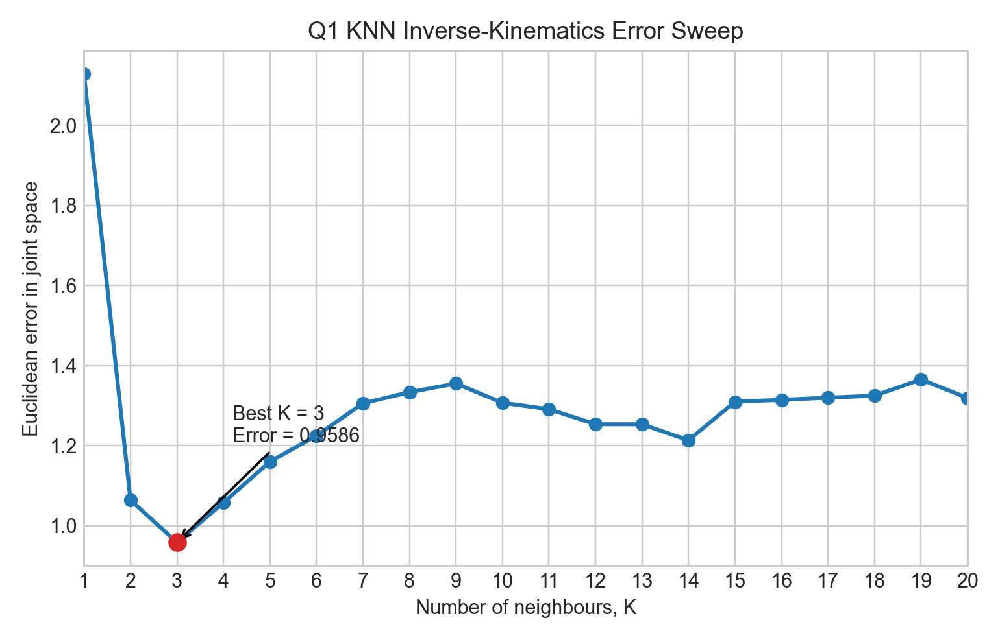
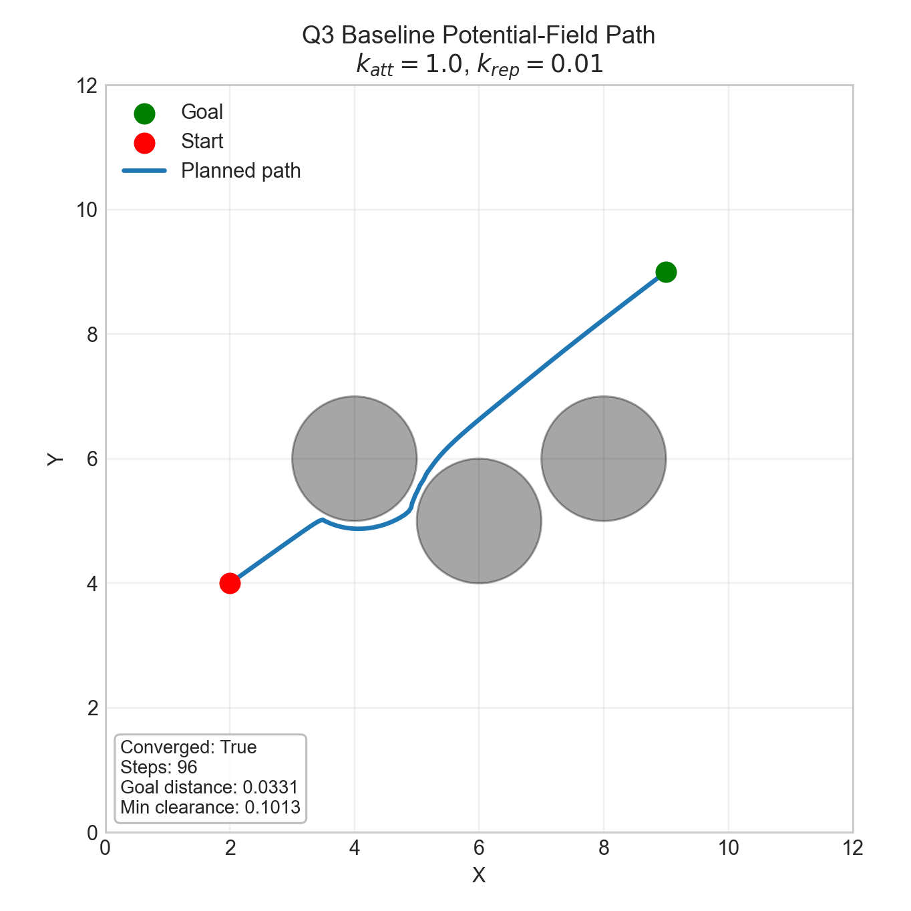
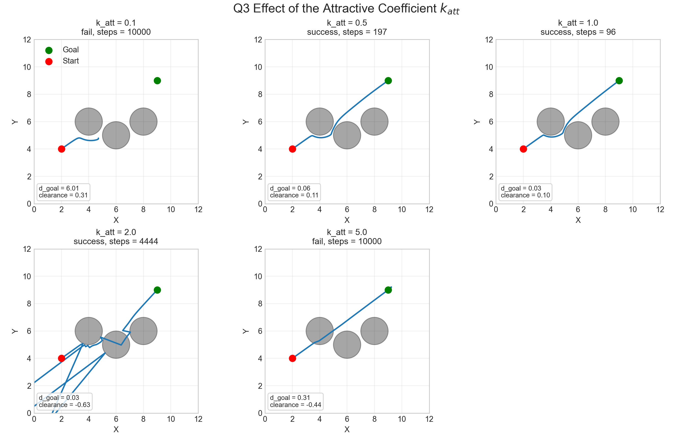
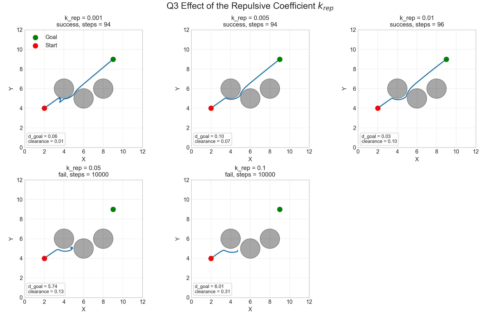

# COMP3631 Coursework Report Draft

## Scope

This report discusses the Jupyter-based components for Q1 and Q3. The focus is not only on whether the code runs, but also on what the results show, which parameter settings work best in the tested environment, and what trade-offs arise from the chosen methods.

## Q1: Inverse Kinematics with K-Nearest Neighbours

The Q1 dataset contains 1000 samples. Each sample stores a 3-D end-effector position and the corresponding 7 joint angles of a 7-DOF manipulator. For a new query position `[-0.17014326, -0.11960592, 1.74256186]`, the notebook computes Euclidean distance in end-effector space, selects the `K` nearest neighbours, and predicts the joint configuration by averaging the neighbours' 7-D joint-angle vectors. The prediction is then compared with the given ground-truth joint angles using Euclidean error in joint space.

The main result is shown in Figure 1. The lowest error in the tested range `K = 1` to `20` occurs at `K = 3`, where the joint-space error is `0.9586`. By comparison, `K = 1` produces an error of `2.1283`, `K = 2` reduces the error to `1.0641`, `K = 4` increases slightly to `1.0578`, and `K = 20` gives an error of `1.3193`. This means that, for this query and this dataset, a very small neighbourhood is too sensitive, while a very large neighbourhood smooths away useful local structure.

This behaviour is consistent with the standard bias-variance trade-off in KNN. When `K` is too small, the prediction is dominated by only one or two samples, so it can change sharply if those samples are noisy or slightly unrepresentative. That is why `K = 1` gives the worst result in the sweep. When `K` is too large, the prediction becomes an average over many neighbours that are progressively less similar to the query point in Cartesian space. In this case the prediction becomes more stable, but it is also more biased, which explains why the error increases again after the minimum near `K = 3`.

There is also a robotics-specific reason why large `K` can be harmful here. This task is an inverse-kinematics approximation problem in a 7-DOF arm, so the mapping from end-effector position to joint configuration is not one-to-one. Similar end-effector positions can correspond to meaningfully different arm postures. Averaging too many joint vectors can therefore blend together different valid inverse-kinematics solutions, producing a predicted joint configuration that is less representative of the actual local solution manifold. In other words, the KNN predictor benefits from local information, but only if the neighbourhood remains tight enough to preserve posture similarity.

The best conclusion is therefore not that `K = 3` is universally optimal, but that it is the best tested trade-off for this specific query and dataset. A limitation of this experiment is that the conclusion is based on a single query point and a fixed sweep over `K = 1` to `20`. A more complete evaluation would repeat the analysis across many query positions and report average error statistics rather than relying on one example alone.

## Q3: Potential-Field Path Planning

In Q3, the planner moves a point robot from the start `(2, 4)` to the goal `(9, 9)` in a 2-D environment containing three circular obstacles of radius `1`. The attractive potential pulls the robot toward the goal, while the repulsive potential is only activated when the robot is within the threshold distance `rho_0 = 2` of an obstacle surface rather than its centre. The total potential is minimised by gradient descent, using PyTorch to compute gradients automatically.

With the baseline parameters `k_att = 1.0` and `k_rep = 0.01`, the planner successfully reaches the goal region in `96` iterations, finishing at a distance of `0.0331` from the goal. The minimum clearance from any obstacle surface along the path is `0.1013`, so this baseline solution remains collision-free in the tested run while still progressing efficiently toward the target. Figure 2 shows this nominal path.

The effect of changing the attractive coefficient `k_att` is shown in Figure 3, with `k_rep` fixed at `0.01`. When `k_att = 0.1`, the goal attraction is too weak and the planner fails to converge within `10000` iterations, stopping `6.0140` units from the goal. Increasing to `k_att = 0.5` leads to successful convergence in `197` iterations, while `k_att = 1.0` improves this further to `96` iterations and gives the best overall balance in the tested sweep. However, making the attraction too strong becomes harmful. At `k_att = 2.0`, the path becomes highly oscillatory and only reaches the goal after `4444` iterations, with negative minimum obstacle clearance, meaning the path penetrates obstacle regions. At `k_att = 5.0`, the planner again fails to converge within the iteration limit.

This shows that larger goal attraction does not automatically produce a better path. Moderate attraction is helpful because it creates a strong enough descent direction toward the goal to overcome shallow local structure in the field. If it is too weak, the robot stalls before reaching the target. If it is too strong, the attractive term dominates obstacle avoidance and, together with the fixed gradient-descent step size, produces overshoot and oscillation. In this environment, `k_att = 1.0` is the most effective tested compromise between progress speed and stable obstacle avoidance.

The effect of the repulsive coefficient `k_rep` is shown in Figure 4, with `k_att` fixed at `1.0`. At `k_rep = 0.001`, the planner converges quickly in `94` iterations, but the minimum clearance is only `0.0137`, so the path passes extremely close to an obstacle. Increasing the repulsion to `k_rep = 0.005` and `k_rep = 0.01` preserves convergence while improving safety margin. The setting `k_rep = 0.01` is particularly reasonable because it still reaches the goal in `96` iterations but increases clearance to `0.1013`. When the repulsion is increased further to `k_rep = 0.05` or `0.1`, the planner fails completely and remains `5.7424` and `6.0140` units from the goal respectively after `10000` iterations.

The reason for this trade-off is that repulsion has two competing roles. On one hand, it is essential for keeping the path away from obstacles and creating a safety margin. On the other hand, if it is too strong, the repulsive gradients from neighbouring obstacles dominate the attractive pull of the goal and create local minima or oscillatory trapping regions. In this tested environment, the intermediate value `k_rep = 0.01` gives the best balance between safety and reachability, while large repulsion makes the corridor between obstacles effectively impassable.

More generally, the potential-field method works well here because it is simple, computationally light, and easy to differentiate with PyTorch. However, the results also show its main weakness: performance is highly sensitive to parameter tuning and to the geometry of the environment. The method does not guarantee global optimality, and it does not guarantee that the robot will avoid local minima. The chosen coefficients should therefore be described as good values for this experiment, not as universally optimal settings.

## Conclusion

Across both tasks, the strongest results come from intermediate parameter choices rather than extreme ones. For Q1, `K = 3` is the best tested setting because it balances local fidelity against oversmoothing in the KNN inverse-kinematics estimate. For Q3, `k_att = 1.0` and `k_rep = 0.01` provide the best tested balance between convergence speed, obstacle clearance, and planner stability. The figures are important because they show that these conclusions are based on observed behaviour rather than generic intuition: small or large parameter values do not simply make the system slower or faster, but can change whether the method remains accurate, safe, and stable at all.
